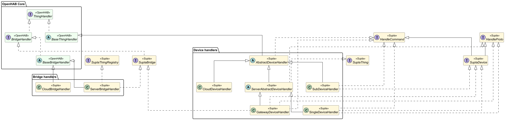

# Handler Hierarchy

The binding's bridge and device handlers build on OpenHAB core abstractions while implementing Supla-specific
contracts. The diagram below summarizes these relationships and highlights where each class originates:

