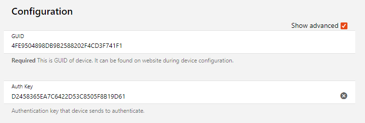
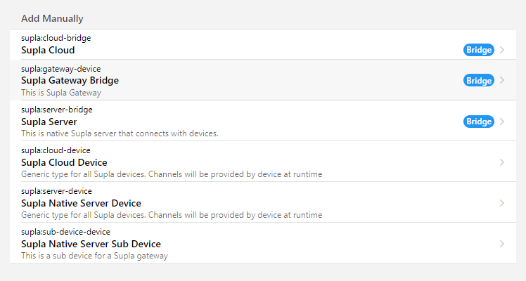

# Supla ❤️ Open HAB

Welcome to the integration of Supla with OpenHAB! Supla is a versatile platform designed for smart home automation,
offering a wide range of devices that enhance the convenience and efficiency of your living space. This OpenHAB plugin
brings the power of Supla to your home automation system, supporting two types of devices: cloud-based and native.
Cloud-based devices leverage Supla's robust cloud infrastructure for seamless connectivity and remote access, while
native devices operate directly within your local network, ensuring rapid response times and offline capabilities.
Together, these options provide flexibility and reliability for all your smart home needs.

## Certified Devices

This binding has been tested and certified to work with a variety of Supla devices, ensuring reliable performance and
seamless integration with your OpenHAB setup. The following devices are officially certified, listed in alphabetical
order:

- [AURATON Aries](https://www.auraton.pl/oferta/ogrzewanie-podlogowe/auraton-aries) (successor to AURATON RTH 8D PRO) is
an advanced wireless control strip, for managing underfloor heating actuators. Designed for installation in electrical
boxes, it provides a versatile and reliable solution for modern heating systems. With its ability to integrate with
other devices, the AURATON Aries is the ideal solution for homes concerned with thermal comfort and energy efficiency.
By installing it with AURATON Vela actuators, you ensure a 10-year warranty on the strip!
- [Auraton Heat Monitor](https://www.auraton.pl/oferta/inteligentny-dom-smart/ogrzewanie/auraton-heat-monitor)  brings
comfort in your home to a new level. The device will ensure that your desired temperature is exactly where you are.
This minimalist thermostat was created to be close to you and your loved ones. Available in two versatile colours:
white and black.
- [Zamel MEW-01](https://supla.zamel.com/product/monitor-energii-elektrycznej-wi-fi-3fn-mew-01/) The highest standard of
accuracy in electricity consumption monitoring available with tools for advanced data analysis. MEW-01 is designed for
DIN-rail (TH35) mounting, occupies a width of two modules and offers the possibility of attaching an external antenna
for use also outside the switchgear.
- [Zamel ROW-01](https://supla.zamel.com/product/odbiornik-wi-fi-dopuszkowy-1-kanalowy-dwukierunkowy-row-01/) belongs to
a family of smart home control products via wi-fi. The device uses SUPLA cloud technology. The ROW-01 module allows
you to control lighting, turn on and off sockets and electrical appliances using a smartphone or tablet. The ROW-01
extension modules are used both as elements for mounting in under- and surface-mounted installation boxes, and as
actuators built directly into the housings of lighting fixtures.
- [Zamel ROW-02](https://supla.zamel.com/product/odbiornik-wi-fi-dopuszkowy-2-kanalowy-dwukierunkowy-row-02/) controller
allows you to control lighting with buttons or switches in bistable mode. In addition, thanks to the built-in wi-fi
module, it is possible to remotely manage lighting using a smartphone application. The device informs about the status
of the lighting. The user can control the lighting from anywhere in the world. Thanks to the cloud application, it is
also possible to automatically start or stop the lighting according to the schedule stored on the cloud.

These devices have been confirmed to work optimally with both the native and cloud-based approaches supported by this
binding, providing a smooth and efficient smart home experience. For any additional devices or updates, please refer to
the official documentation or the device compatibility section within the binding's settings.

## Native Server

This binding supports Supla native devices using the native protocol, allowing the binding to act as a server and
enabling direct communication with your Supla devices without the need for a third-party server.

By using the native protocol, all interactions with your Supla devices are contained within your local network. This
approach offers several benefits, including increased security, reduced latency, and the ability to continue operating
even if your internet connection is down. This setup ensures that your smart home system remains efficient, reliable,
and responsive at all times.

However, it's important to note that by opting for this setup, you lose the integration with Supla Cloud. This means you
won't have remote access through the Supla Cloud app or benefit from cloud-based services and updates provided by Supla.
Ensure this trade-off aligns with your smart home requirements before proceeding with the native device configuration.

## Cloud

To connect your Supla cloud devices to OpenHAB, you'll need to use the Supla Cloud Bridge. This bridge facilitates
communication between OpenHAB and Supla's cloud infrastructure. The first step in setting up this connection is to
generate an OAuth token from the Supla Cloud.

Follow these steps to generate your OAuth token:

1. Visit the Supla Cloud security page at https://cloud.supla.org/security/personal-access-tokens.
2. Create a new personal access token by following the instructions on the page.
3. An example token might look like
this:
`MzI4YjJiYTdmMjF4MDY3NDZmMmE5NDUyZTEnOTc2ZThwNjc0Yjc0Y1lhMjc0NjViDGM5ZVQwMzBkMTAmMzg1Ng.aHR0cHM6Ly9zdnIxLnN1cGxhLm9yZw==`.

### Cloud API Limits

It's important to be aware that the Supla Cloud API has limits on the number of invocations per hour. By default, this
limit is set to **2000 requests per hour**. If you find that you are exceeding this limit, you may encounter issues with
connectivity and data updates.

To monitor your API usage and check your current limits, you can
visit [https://cloud.supla.org/account](https://cloud.supla.org/account). Navigate to **Account > Show my limits** to
see your API invocation details.


If you consistently exceed the 2000 requests per hour limit, you can request an increase from Supla administrators.
Alternatively, you can adjust the refresh interval and cache eviction settings in the bridge properties within OpenHAB.
By increasing the refresh interval and managing cache settings, you can reduce the frequency of API calls, ensuring you
stay within the allowable limits and maintain smooth operation of your smart home system.


## Comparison: Native vs. Cloud Approach

| Aspect               | Native                                    | Cloud              |
|----------------------|-------------------------------------------|--------------------|
| Request Limits       | ✅ None                                    | ❌ 2000 req/h limit |
| Response Time        | ✅ Faster                                  | ❌ Slower           |
| Supla Application    | ❌ Not compatible                          | ✅ Compatible       |
| Online Access        | ❌/✅ None (Can be achieved with myOpenHAB) | ✅ Available        |
| Internet Requirement | ✅ Not required                            | ❌ Required         |

When deciding between a native or cloud approach for integrating Supla devices into your OpenHAB system, consider
factors such as request limits, response time, compatibility with Supla applications, online access requirements, and
the need for internet connectivity. Choose the approach that best aligns with your smart home setup and preferences.

## Installation

There are three ways to install the OpenHAB plugin for Supla:

1. **From Marketplace (Recommended):**
Install the plugin directly from [OpenHAB's Marketplace](https://community.openhab.org/t/supla-integration/156114).
Simply search for "Supla" in the Marketplace and follow the
installation instructions.

2. **Install via Karaf's `bundle:install`:**
If you prefer a manual installation method, you can install the plugin using Karaf's `bundle:install` command. This
method allows you to directly add the plugin bundle to your OpenHAB installation.
	1. [Log in to Karaf console](https://www.openhab.org/docs/administration/console.html)
	2. Check is a Supla bundle is not installed: `bundle:list`
		1. (Optional) Uninstall previous bundle: `bundle:uninstall <pid>`
	3. Install:
	`bundle:install -s url:https://github.com/magx2/openhab-supla/releases/download/supla-X.Y.Z/supla-X.Y.Z.jar`
	4. Check if installation was successful: `bundle:list`

3. **Download JAR File from Releases Page:**
Alternatively, you can download the JAR file from the official GitHub releases page
at https://github.com/magx2/openhab-supla/releases. Once downloaded, place the JAR file in the addons folder within
your OpenHAB installation directory. For more information on manually provided add-ons, refer to the OpenHAB
documentation [here](https://www.openhab.org/docs/configuration/addons.html#through-manually-provided-add-ons).

Choose the installation method that best fits your preferences and requirements to get started with integrating Supla
devices into your OpenHAB environment.

## Actions

### Set Device Config

Set Device Config action allows to send new configuration to the given device.

Methods:

- `setDeviceConfig(String... configs)`
- `setDeviceConfig(List<String> configs)`

`config` can take one of the values:

1. `StatusLedConfig:statusLed`
	- `statusLed` (`[ON_WHEN_CONNECTED|OFF_WHEN_CONNECTED|ALWAYS_OFF]`)
2. `ScreenBrightnessConfig:screenBrightness,automatic,adjustmentForAutomatic`
	- `screenBrightness` (`int`):
	- `automatic` (`boolean`):
	- `adjustmentForAutomatic` (`int`):
3. `ButtonVolumeConfig:volume`
	- `volume` (`int`, min: `0`, max `100`)
4. `DisableUserInterfaceConfig:userInterface` or `DisableUserInterfaceConfig:userInterface,minTemp,maxTemp`
	- `userInterface` (`[DISABLED|ENABLED|PARTIAL]`)
	- `minTemp` (`int`)
	- `maxTemp` (`int`)
5. `AutomaticTimeSyncConfig:enabled`
	- `enabled` (`boolean`)
6. `HomeScreenOffDelayConfig:enabled,duration`
	- `enabled` (`boolean`)
	- `duration` (`java.time.Duration`) - [duration](https://docs.oracle.com/en/java/javase/17/docs/api/java.base/java/time/Duration.html) format, i.e.
		- `PT20.345S` - parses as "20.345 seconds"
		- `PT15M` - parses as "15 minutes" (where a minute is 60 seconds)
		- `PT10H` - parses as "10 hours" (where an hour is 3600 seconds)
		- `P2D` - parses as "2 days" (where a day is 24 hours or 86400 seconds)
		- `P2DT3H4M` - parses as "2 days, 3 hours and 4 minutes"
		- `PT-6H3M` - parses as "-6 hours and +3 minutes"
		- `-PT6H3M` - parses as "-6 hours and -3 minutes"
		- `-PT-6H+3M` - parses as "+6 hours and -3 minutes"
7. `HomeScreenContentConfig:contents`
	- `contents` (`List<[NONE|TEMPERATURE|TEMPERATURE_AND_HUMIDITY|TIME|TIME_DATE|TEMPERATURE_TIME|MAIN_AND_AUX_TEMPERATURE|MODE_OR_TEMPERATURE]>`)
8. `PowerStatusLedConfig:disabled`
	- `disabled` (`boolean`)

#### Example

```
rule "Set Device Config"
when
	<TRIGGER>
then
val actions = getActions("supla", "supla:gateway-device:8e6baab333")
									// or server-bridge
									// or server-device
actions.setDeviceConfig("PowerStatusLedConfig:false", "StatusLedConfig:OFF_WHEN_CONNECTED")
end
```

## FAQ 🤔

### SSL Problem

In some Java environments, unlimited cryptography might be turned off. To enable it, you need to set the `crypto.policy`
to `unlimited`.

For more information, you can read the
post [Enabling Unlimited Strength Cryptography in Java](https://www.baeldung.com/jce-enable-unlimited-strength).

**Note:** In a Docker environment, it is sufficient to set the environment variable `CRYPTO_POLICY` to `unlimited`.

### Disabled algorithms

This chapter provides instructions on how to enable TLS 1.0 and TLS 1.1, which are disabled by default starting from
Java 8.

#### Enabling TLS 1.0 and TLS 1.1

Follow the steps below to enable TLS 1.0 and TLS 1.1:

1. Navigate to the `java.security` file located in your Java installation directory. The file can be found in either of
the following paths:
	- `$JAVA_HOME/conf/security`
	- `$JAVA_HOME/lib/security`

2. Open the `java.security` file and locate the `jdk.tls.disabledAlgorithms` property.

3. Remove `SSLv3`, `TLSv1`, and `TLSv1.1` from the `jdk.tls.disabledAlgorithms` property.

4. Save and close the `java.security` file.

##### Docker 🐳

1. Log in into container: `docker exec -it <docker-container-id> /bin/bash`
2. Go to folder with `java.security`: `cd /usr/lib/jvm/java-17-openjdk-amd64/conf/security`
3. Do a backup: `cp java.security java.security.bak`
4. Check current settings: `cat java.security | grep jdk.tls.disabledAlgorithms`
5. Replace
it:
`sed -i -E '/^jdk\.tls\.disabledAlgorithms=/ s/(,\s*)?(SSLv3|TLSv1\.1?|TLSv1)(,\s*)?//g' java.security`
6. Check changed settings: `cat java.security | grep jdk.tls.disabledAlgorithms`
7. Compare changes: `diff java.security java.security.bak`
8. Exit and restart docker container

#### Restarting OpenHAB

After enabling TLS 1.0 and TLS 1.1, a restart of OpenHAB is required for the changes to take effect. Please follow the
standard procedure for restarting your OpenHAB instance.

**Note:** Always ensure to backup any files or settings before making changes. This will help you to restore the
original settings if something goes wrong.

### How to Enable Logging

To enable logging for the Supla plugin in OpenHAB, follow these steps:

1. Open the `log4j2.xml` file located in the `userdata/etc/` directory
2. Add the following configuration in the appenders section:

```xml
<!-- supla -->
<RollingFile fileName="${sys:openhab.logdir}/supla.log" filePattern="${sys:openhab.logdir}/supla.log.%i.gz"
			name="SUPLA">
	<Policies>
		<OnStartupTriggeringPolicy/>
		<SizeBasedTriggeringPolicy size="1 MB"/>
	</Policies>
	<DefaultRolloverStrategy max="7"/>
	<PatternLayout pattern="%d{yyyy-MM-dd HH:mm:ss.SSS} [%-5.5p] [%-36.36c] - %m%n"/>
</RollingFile>
```

3. Add the following configuration in the loggers section:

```xml
<!-- supla -->
<Logger name="pl.grzeslowski.jsupla.server" level="debug" additivity="false">
	<AppenderRef ref="SUPLA"/>
</Logger>
<Logger name="pl.grzeslowski.jsupla.protocol" level="debug" additivity="false">
<AppenderRef ref="SUPLA"/>
</Logger>
<Logger name="pl.grzeslowski.openhab.supla" level="debug" additivity="false">
<AppenderRef ref="SUPLA"/>
</Logger>
<Logger name="io.netty" level="debug" additivity="false">
<AppenderRef ref="SUPLA"/>
</Logger>
<Logger name="org.openhab.binding.supla.internal.server" level="debug" additivity="false">
<AppenderRef ref="SUPLA"/>
</Logger>
```

By following these steps, you will enable detailed logging for the Supla plugin, which can help with debugging and
monitoring the plugin's activity within OpenHAB.

### Thing with Sub Devices

If you create a `Supla Native Server Device` thing (either manually or through service discovery) and your Supla device
is actually a gateway device, you need to follow these steps to correct the setup.

First, open the configuration of the current thing, enable advanced options, and copy the `GUID` and `Auth Key`.

Once you've saved this
information, remove the thing. Next, add a new gateway bridge thing, and during the configuration, paste the `GUID`
and `Auth Key` copied from the previous thing.

Once the Supla device connects, any sub-devices linked to the gateway should appear automatically in the inbox.

## Support ❤️

If you want to support the author of this binding, buy him a coffee:

[](https://ko-fi.com/S6S8UBWWY) <a href="https://buycoffee.to/magx2" target="_blank"></a>
